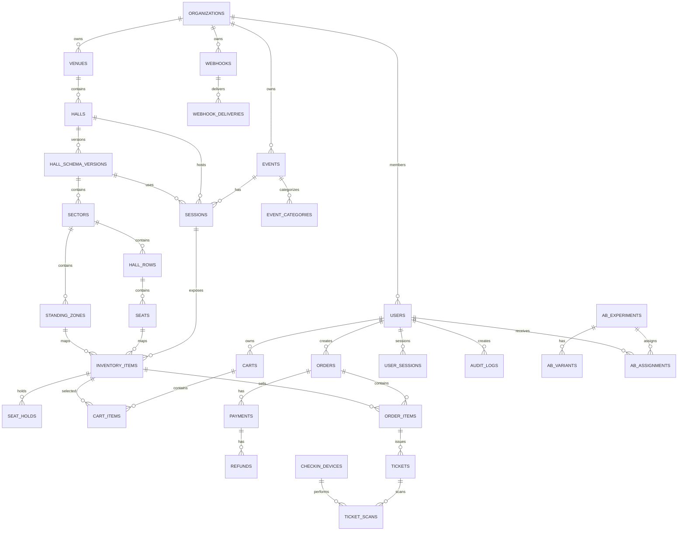

# NABILET Core v1 — полная техническая спецификация разработки

## 0. Статус документа

- Версия: 1.0
- Статус: implementation baseline
- Основной backend: Laravel 13 / PHP 8.3+
- Основная БД: MySQL 8.4+
- API: REST `/api/v1`
- Монолит: modular monolith
- Android client: `NABILET Checker`
- Frontend: Vue 3 + TypeScript

## 1. Цели

Система должна обеспечивать полный жизненный цикл:

`Venue → Hall → HallSchemaVersion → Event → Session → InventoryItem → Hold → Cart → Order → Payment → Ticket → Check-in`.

Ключевые инварианты:

1. Одно продаваемое место не может иметь два активных оплаченных билета в одном Session.
2. Hold атомарен и конкурентно безопасен.
3. Payment webhook идемпотентен.
4. Успешная оплата подтверждается сервером, а не redirect пользователя.
5. Билет выпускается максимум один раз на один `OrderItem`.
6. Ticket check-in атомарен.
7. Опубликованная версия схемы immutable.
8. Цена от frontend не считается доверенной.
9. Все critical POST поддерживают `Idempotency-Key`.
10. Критические административные изменения логируются в Audit Log.

## 2. Репозиторий

```text
nabilet/
├── app/
│   ├── Core/
│   ├── Modules/
│   │   ├── Auth/
│   │   ├── Users/
│   │   ├── Organizations/
│   │   ├── Events/
│   │   ├── Venues/
│   │   ├── HallSchemas/
│   │   ├── Sessions/
│   │   ├── Inventory/
│   │   ├── Cart/
│   │   ├── Orders/
│   │   ├── Payments/
│   │   ├── Tickets/
│   │   ├── Checkin/
│   │   ├── Notifications/
│   │   ├── SEO/
│   │   ├── Analytics/
│   │   ├── Telegram/
│   │   ├── Embed/
│   │   ├── Webhooks/
│   │   ├── AI/
│   │   ├── Media/
│   │   └── Admin/
│   └── Providers/
├── database/
├── resources/
├── routes/
├── plugins/
├── tests/
├── docs/
└── public/
```

## 3. DB conventions

- Все PK: `BIGINT UNSIGNED AUTO_INCREMENT`.
- Внешние публичные идентификаторы: `CHAR(26)` ULID.
- Денежные поля: `BIGINT` в минимальных единицах валюты.
- JSON: `JSON` only для flexible metadata/snapshots, не для основных relational fields.
- Все timestamps: `DATETIME(6)` UTC.
- `organization_id` используется для tenant scoping там, где сущность принадлежит организации.
- Soft delete использовать только для сущностей, где удаление не должно нарушать исторические данные.

## 4. Полная ER-модель



### 4.1 Core tables

| Table | Назначение |
|---|---|
| organizations | организаторы / tenants |
| users | покупатели и сотрудники |
| roles / permissions / role_permissions | RBAC |
| user_organization | membership |
| user_sessions | web sessions |
| login_logs | история входов |
| venues | площадки |
| halls | залы |
| hall_schema_versions | версии схем |
| sectors | сектора |
| hall_rows | ряды |
| seats | физические места |
| hall_tables | столы |
| standing_zones | standing inventory definitions |
| events | мероприятия |
| event_categories | категории |
| event_translations | переводы |
| sessions | конкретные сеансы |
| inventory_items | продаваемые units |
| seat_holds | временные резервы |
| carts / cart_items | корзина |
| orders / order_items | заказы |
| payments / payment_transactions | платежи |
| refunds | возвраты |
| tickets | выпущенные билеты |
| ticket_templates | шаблоны |
| ticket_scans | check-in/audit scans |
| checkin_devices | устройства контролёров |
| notifications / notification_templates | уведомления |
| consents / privacy_requests | GDPR |
| redirects / seo_meta / pages | SEO/CMS |
| analytics_events | product analytics |
| ab_experiments / variants / assignments / metrics | A/B |
| heatmap_events | heatmap |
| webhooks / deliveries / webhook_events | integrations |
| api_keys / idempotency_keys | API security |
| ip_rules | IP rules |
| modules / settings | system |
| audit_logs | audit trail |

## 5. Inventory model

`Seat` — физическое место в схеме.

`InventoryItem` — продаваемый экземпляр для конкретного Session.

Обычное место:

```text
capacity = 1
available_quantity = 1
seat_id = X
```

Standing zone:

```text
capacity = 1000
available_quantity = 1000
standing_zone_id = X
```

Цена, статус и остаток для продажи принадлежат InventoryItem.

## 6. Hall Schema versioning

- Draft version можно менять.
- При публикации версия становится immutable.
- При изменении опубликованной схемы создаётся новая версия.
- Session всегда хранит `schema_version_id`.
- Исторические OrderItem/Ticket дополнительно сохраняют `seat_snapshot_json`.

## 7. Hold algorithm

```text
BEGIN
  SELECT inventory_item FOR UPDATE
  REMOVE expired holds for item
  CHECK quantity >= requested
  DECREASE available_quantity
  INSERT seat_hold
COMMIT
```

Для обычного места requested quantity всегда 1.

Для standing requested quantity может быть N.

Hold default: 10 минут. Конфигурируемый диапазон: 5–30 минут.

## 8. Order state machine

```text
pending
  ├─> awaiting_payment
  ├─> cancelled
  └─> expired

awaiting_payment
  ├─> paid
  ├─> payment_failed
  ├─> cancelled
  └─> expired

paid
  ├─> partially_refunded
  └─> refunded
```

Запрещённые переходы должны приводить к `INVALID_STATE_TRANSITION`.

## 9. Payment state machine

```text
pending
  ├─> waiting_for_capture
  ├─> succeeded
  ├─> canceled
  └─> failed

waiting_for_capture
  ├─> succeeded
  └─> canceled
```

Для MVP рекомендуется one-stage payment: `capture=true`.

Webhook является источником истины для окончательного статуса.

## 10. Ticket state machine

```text
issued
  ├─> used
  ├─> cancelled
  ├─> refunded
  └─> expired
```

`used` не может вернуться в `issued`.

## 11. Hold state machine

```text
active
  ├─> converted
  ├─> released
  └─> expired
```

`expired` означает автоматическое освобождение inventory.

## 12. Check-in state machine

Check-in не меняет state диаграммой самого `Ticket` в отдельной очереди: операция `use` атомарно переводит `issued -> used`.

Результаты попытки сканирования:

```text
valid
already_used
cancelled
refunded
expired
invalid_signature
wrong_session
wrong_event
unknown_ticket
conflict
```

## 13. Payment idempotency

Каждый запрос создания платежа получает уникальный `Idempotency-Key`.

Webhook event deduplication выполняется по:

```text
(provider, provider_event_id)
```

Повтор webhook не должен повторно:

- создавать ticket;
- менять Order status;
- отправлять success notification;
- уменьшать inventory.

## 14. Ticket issuance algorithm

```text
BEGIN
  LOCK Order
  VERIFY Order = paid
  FOR each OrderItem
     if tickets not exist:
        create tickets
  COMMIT
```

Уникальное ограничение не допускает повторную выдачу на один `order_item_id + ticket ordinal`.

## 15. Check-in algorithm

```text
BEGIN
  SELECT ticket FOR UPDATE
  VERIFY ticket/session/event
  VERIFY signature/token
  IF status != issued -> reject
  status = used
  used_at = now
  INSERT ticket_scan
COMMIT
```

## 16. API security

- Browser auth: Laravel session + CSRF.
- API mobile/checker: short-lived bearer access token + refresh token or device token.
- Admin: RBAC + policies + optional mandatory 2FA.
- API critical mutations: `Idempotency-Key`.
- Object access always scoped by authenticated principal and organization.
- Passwords never returned.
- Secrets never returned.

## 17. OAuth

Providers:

- Yandex
- VK
- Telegram Mini App auth

Telegram `initData` валидируется server-side до использования user data. `initDataUnsafe` не является доверенным источником.

## 18. Embed security

Каждый organization имеет whitelist allowed domains.

Backend проверяет:

- Origin;
- embed token;
- organization ownership;
- event access;
- payment capability.

## 19. Webhook security

Outbound:

```text
X-Nabilet-Event
X-Nabilet-Delivery
X-Nabilet-Signature = HMAC-SHA256
```

Inbound provider webhooks:

- verify provider requirements;
- persist raw event;
- deduplicate;
- dispatch processing job.

## 20. Background jobs

- CleanupExpiredHolds
- ProcessPaymentWebhook
- IssueTickets
- GenerateTicketPdf
- SendEmail
- SendTelegramMessage
- DeliverWebhook
- AggregateAnalytics
- GenerateSitemap
- ProcessRefund
- SyncCheckin

## 21. Analytics event contract

```json
{
  "name": "seat_selected",
  "session_id": "01...",
  "event_id": "01...",
  "properties": {
    "inventory_id": "01..."
  },
  "occurred_at": "2026-09-18T12:00:00Z"
}
```

Не записывать содержимое password/payment fields. Heatmap/sessions должны учитывать consent.

## 22. A/B Testing

Assignment должен быть стабильным для пользователя/anonymous visitor в рамках experiment.

Метрики:

- impressions
- clicks
- cart_created
- checkout_started
- payment_success
- revenue

## 23. SEO

Каждая indexable content entity поддерживает:

- slug
- title
- meta description
- canonical
- robots
- OpenGraph
- Schema.org
- sitemap inclusion

## 24. Admin routes

Основная область:

```text
/admin
/admin/events
/admin/sessions
/admin/venues
/admin/halls
/admin/schemas
/admin/orders
/admin/payments
/admin/tickets
/admin/checkin
/admin/users
/admin/analytics
/admin/settings
/admin/integrations
```

## 25. Installer acceptance criteria

```text
/install
  requirements -> database -> site -> admin -> migrations -> done
```

После установки создаётся `storage/install.lock`, повторный запуск запрещён.

## 26. Test matrix

Обязательные интеграционные тесты:

### Concurrent seat hold

100 concurrent requests на один inventory item.

Expected: ровно один successful hold для seat, либо N успешных в standing в пределах capacity.

### Duplicate payment webhook

Один webhook отправить 5 раз.

Expected: один payment transition, один ticket issuance.

### Concurrent check-in

2–10 checker requests для одного ticket одновременно.

Expected: ровно один `used`, остальные `already_used`.

### Unauthorized object access

Подмена order/ticket ID.

Expected: 403 или 404, никогда чужие данные.

### Expired hold

Проверить auto-release inventory.

## 27. Definition of Done

Feature принимается только при наличии:

- implementation;
- migration;
- validation;
- authorization;
- tests;
- OpenAPI update;
- documentation;
- error handling;
- audit/logging where applicable.

## 28. Release workflow

```text
feature branch
  -> tests
  -> static analysis
  -> security checks
  -> build
  -> staging
  -> smoke tests
  -> backup
  -> migration
  -> deploy
  -> health check
```

## 29. Обязательные инструменты качества

- PHPStan
- Laravel Pint
- PHPUnit/Pest
- ESLint
- Prettier
- TypeScript strict mode
- Playwright для критических E2E
- SAST/dependency audit

## 30. Источники и актуальность интеграций

Laravel 13 требует минимум PHP 8.3; официальная таблица поддержки указывает bug fixes до Q3 2027 и security fixes до 17 марта 2028.  
ЮKassa документирует идемпотентность API, webhook-события и рекомендует отслеживать изменения статуса через входящие уведомления; для обычного one-stage payment используется `capture=true`.  
Telegram требует серверной проверки `initData`, а `initDataUnsafe` нельзя считать доверенным.  

Ссылки:

- https://laravel.com/framework/docs/releases
- https://yookassa.ru/developers/api
- https://yookassa.ru/developers/using-api/webhooks
- https://yookassa.ru/developers/using-api/openapi-specification
- https://core.telegram.org/bots/webapps
