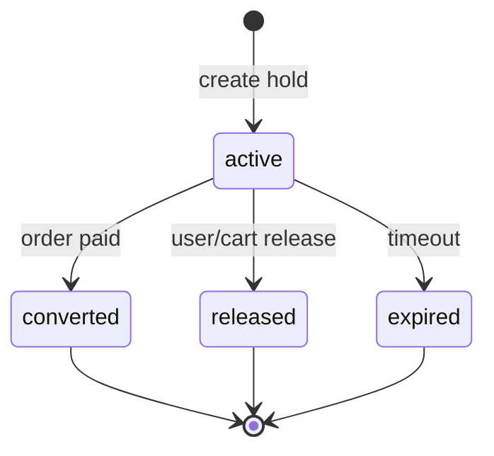
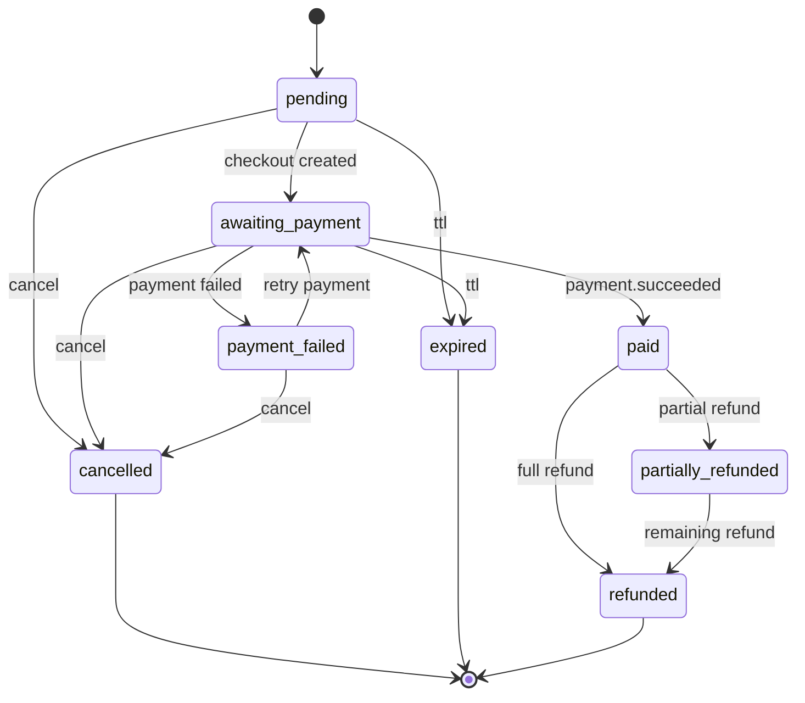
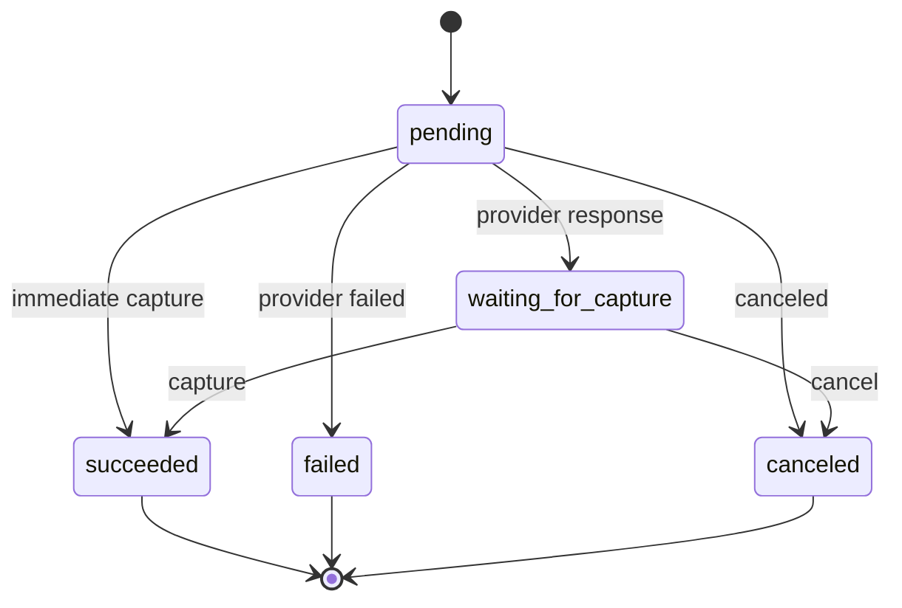
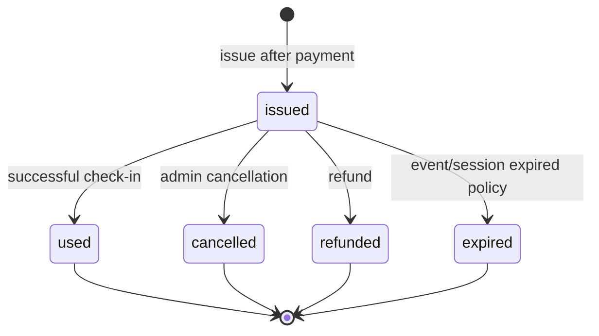
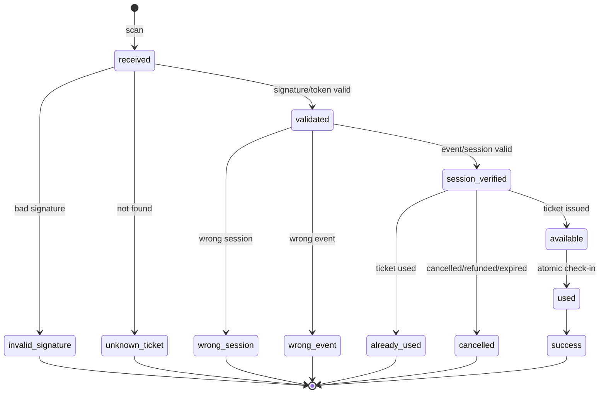
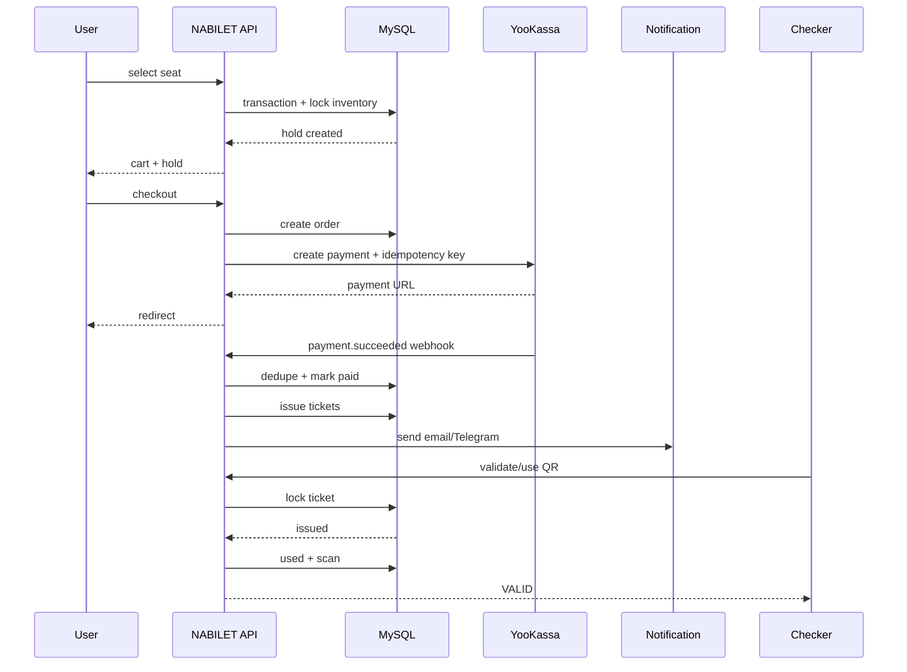

# NABILET Core v1 — State Diagrams

## 1. Hold



### Invariants

- `active` reserve quantity in InventoryItem.
- `released/expired` restore quantity exactly once.
- `converted` must not restore quantity.
- Hold cleanup is idempotent.

---

## 2. Order



### Invariants

- Only `paid` can issue tickets.
- `cancelled/expired` cannot become `paid`.
- Refund transitions only from paid/refundable states.

---

## 3. Payment



### MVP

Use one-stage payment:

`pending -> succeeded|failed|canceled`.

### Invariants

- Final provider state must be reconciled server-side.
- `payment.succeeded` can trigger order payment exactly once.
- Duplicate provider webhook is no-op after deduplication.

---

## 4. Ticket



### Invariants

- `used` is terminal.
- `used` ticket cannot be reactivated.
- QR validation is independent from display metadata.

---

## 5. Check-in attempt

Check-in попытка — не отдельное состояние Ticket, а результат атомарной операции.



### Concurrent check-in

```text
Request A: lock ticket -> issued -> used -> success
Request B: waits lock -> sees used -> already_used
```

---

## 6. Composite business flow


